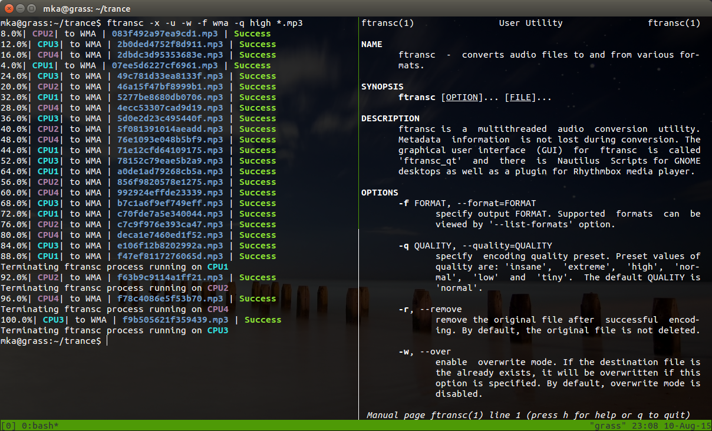
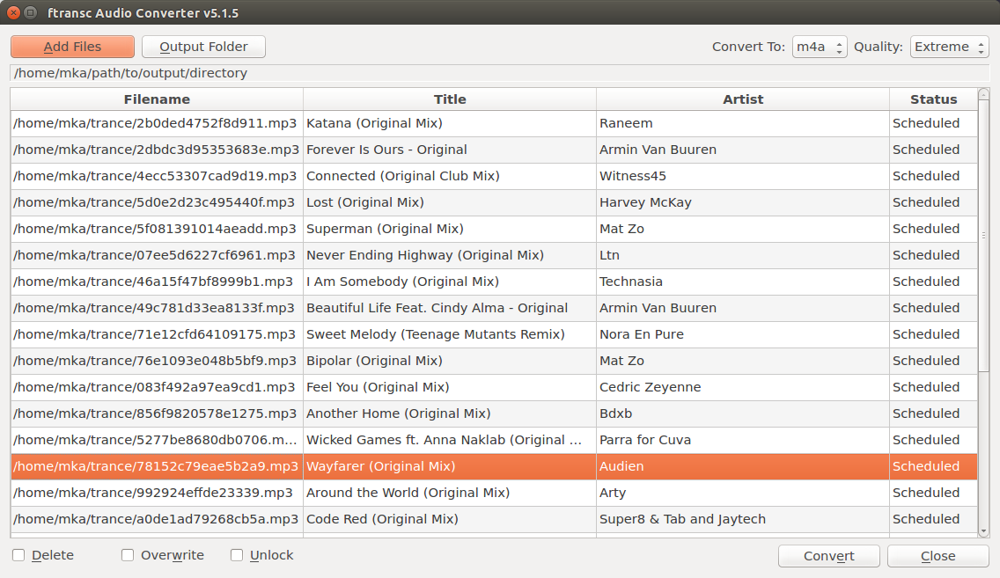
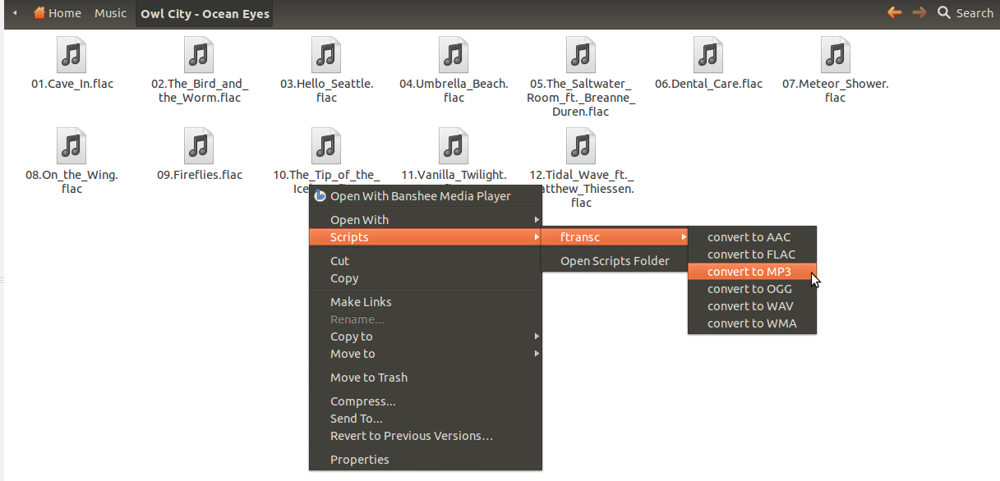
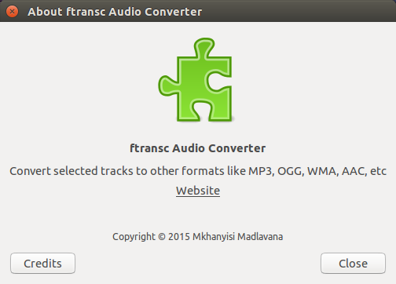
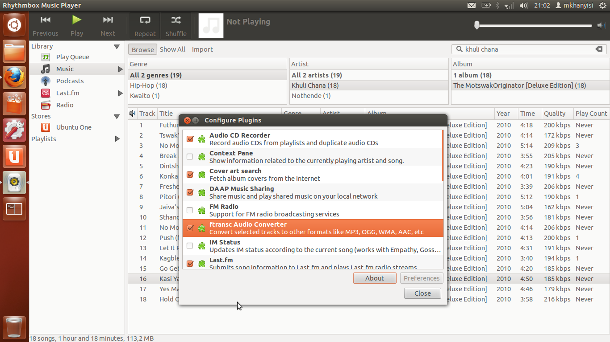
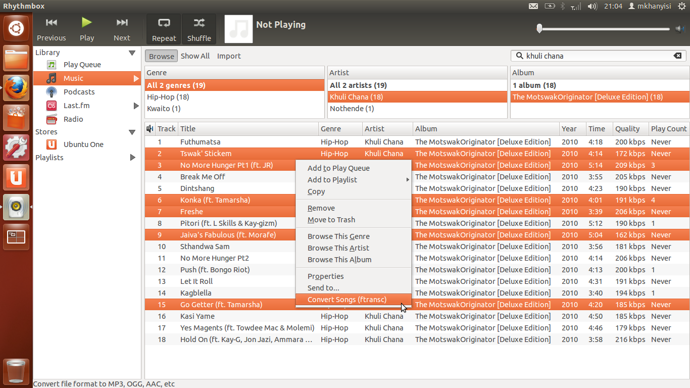

[](https://travis-ci.org/dopstar/ftransc) [](https://pypi.python.org/pypi/ftransc) [](https://pypi.python.org/pypi/ftransc)

# What is ftransc

`ftransc` is the python audio conversion library. It can convert local files or files from youtube (even youtube playlists).


## Installing ftransc


ftransc can be installed as follows:

```
    pip install ftransc
```

Then FFMpeg must also installed as follows:

- On Linux based systems:
```
    sudo apt-get install ffmpeg lame flac vorbis-tools
```

- On Mac OS X:
```
    brew install ffmpeg lame
```


## Examples 

Example 1 - converting from MP3 to OGG:
```
    ftransc -f ogg filename.mp3
```
The output file name for the above example will be 'filename.ogg'

Example 2 - converting from MP3 to AAC, removing original file on success, using high quality preset:
```
    ftransc -r -q extreme -f aac filename.mp3
```

Example 3 - extract audio content from a video files into the MP3 format, use best quality preset:
```
    ftransc -q insane -f mp3 filename2.avi filename3.mpg filename4.vob ...
```

Example 4 - convert all audio files inside a given folder into WMA format. (This option is not recursive to child-folders)
```
    ftransc -f wma --directory /path/to/folder_name
```

Example 5 - convert all audio audio files (and extract all audio content from video files) inside a given folder recursively including all sub-/child-folders, ftransc should be used with the 'find' command in the pipeline as follows:
```
    find /path/to/folder_name -type f -print0 | xargs -0 ftransc -f aac -q high
```

## ftransc Quality Presets

ftransc uses quality presets called 'insane', 'extreme', 'high', 'normal', 'low', and 'tiny'. These presets are specified by the '-q' or '--quality' option of ftransc and are defined in the '/etc/ftransc/presets.conf' configuration file. 

The `/etc/ftransc/presets.conf` presets file can be overriden by use of the --presets option and specify the custom presets file to use or, if you know what you are doing, make changes directly on the it.


## ftransc Metadata Tags

The following is the list of supported tags across audio formats that ftransc can encode to. N means the tag is not supported and hence is lost during conversion. Y means the tag is supported and is present on the new file after conversion:

| *tag* | *m4a* | *mp3* | *ogg* | *flac* | *wma* | *mpc* | *wav* | *wv* |
|-------|-------|-------|-------|--------|-------|-------|-------|------|
| title | Y	| Y 	| Y 	| Y 	 | Y	 | Y 	 | N 	 | Y 	|
| artist | Y | Y | Y | Y | Y | Y | N | Y |
| album  | Y | Y | Y | Y | Y | Y | N | Y |
| genre  | Y | Y | Y | Y | Y | Y | N | Y |
| date   | Y | Y | Y | Y | Y | Y | N | Y |
| tracknumber | Y | Y | Y | Y | Y | Y | N | Y |
| composer    | Y | Y | Y | Y | Y | Y | N | N |
| publisher   | N | Y | N | N | Y | N | N | N |
| lyrics | Y | Y | N | N | Y | N | N | N |
| album art   | Y | Y | N | Y | N | N | N | N |
| album artist | N | N | N | N | N | N | N | N |
| comment     | N | N | N | N | N | N | N | N |

______

## Screenshots

The image below shows `ftransc` command in action on Terminal as well as the ftransc manpage (`man ftransc`):



_____

ftransc GUI front-end, *ftransc_qt*:



_____

ftransc also uses Nautilus Scripts, so you can right click selection of files and convert like:



_____

### ftransc plugin for Rhythmbox media player:

- The ftransc plugin for rhythmbox media player allows one to send files from Rhythmbox music player to ftransc for conversion.


____

- Enabling the plugin:


____

- Converting songs with ftransc from Rhythmbox



